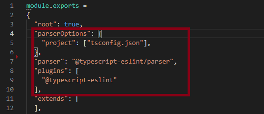

# Coderitter Typescript coding style

## Getting started

All folders, which should not be corrected by the linter you have to put in the `.eslintignore` file. 
You can start the linter with `npm run lint` and you can fix all though linter fixable warnings with `npm run fix`.

## Configurations for JavaScript

**camelcase** : 
- every veriable, constant, class and method should be represented in camelcase
- classes should thereby begin with a capital letter **ClassName**
- attributes, methods, functions, variables and constants should beginn with a lower case letter **methodName**, **functionName**, **variableName**, **constantName**
- **reason** : just uniform style of naming

**semicolons** :
- should never be set in critial cases (for example the next line begins with a bracket)

	`line = line + of + code`
- but: 

	```
      let a = {}
      ;(a as User).name = 'Name'
- **reason**: less charakter in code --> less characters you can forget 

**stroustrup** :
- is the following brace-style:
	```
    if {
        //some code here
    }
    else {
        //some other code here
    }
- **reason** : compromise between 1TBS (else on line from closing-if brace) and Allman (newlin for every brace and if/ else

**mandatory braces**:
- also in controlstatements with only a single line of code there should be braces
	```
   if {
       return true
   }
- **reason** : if you want to change a single line to a multi line if you could forget to set the braces

**indent** :
- 4 spaces
- **reason** : uniform style of indent

**no trailing spaces**:
- there should be no trailing spaces at the end of a line
- **reason** : extra spaces have no functional issues

**no multi spaces**:
- there should be not multiple spaces following each other
- **reason**: why should somebody need this, if there are some, this could only be by mistake and they have no functional issues

**no console** :
- in your pushed code should be no console statement active
- **reason** : we have the lib "knight-log" where statements can be visualized. This logs can be turned on and off, so everyone can see exactly the logs he/ she wanted to see and don't have to search for unwanted disturbing logs, which fill up the hole console.

## Typescript Configuration

There esists an plugin for eslint which implements typescript specific rules. This rules are by default turned on, but you can turn them of by deleting all rules which begin with `@typescript-eslint` and remove the lines shown below in `eslintrc.js`.



### No unused Code

**no unused vars** : 
- explains itself
- **reason** : If you don't need them, why should they be there? It only reduces the readability of your code.

**no empty interface** :
- explains itself
-**reason** : If you don't need them, why should they be there? It only reduces the readability of your code.

### Typedefinitions

**Array**
- only use type[] (not Array<type>) for declare arrays
- **reason** : just to unify the code

**Type Defintion**
- for defining new types the `interface`- keyword should be used (instead of the `type`- keyword)
- **reason** : just to unify the code

### ClassRules

**no public**
- All methods and attributes which are not declared public or private are public, so only the once which are private had to get the keyword `private`
- **reason** : Avoid unnecessary code

### Naming Convention

- *default format* is *strictCamelCase*
- *class, enums and interfaces* should use *StrictPascalCase*
- *enumMembers* shoud use *UPPER_CASE*
- **additional Rules**:
    - *boolean* variables should begin with *"is", "should", "has", "can", "did" or "will"*
    - *private attributes or methods* should start with an *underscore*
- **reason** There should be an uniform naming convention for all programming Objects, to unify the code and to recgonize types on first sight

### Rules for reducing errors

**no for in in arrays**
- Do not use the `for in`- loop on arrays.
- **reason** : The for in loop is implemented for object, but you can use it also on arrays. It oiterates over the indices as string, but in an array you mostly don't want this, so better avoid this loop and use the `for of` - loop.

**no misused promises**
- Don't forget to `await` your promise before using it.
- **reason**: If you not await the promise, the result could be unexpected. 

**no this aliasing**
- Lines of code like ```let m = this``` should be avoided
- **reason**: This lines are unnecessary. There are better solutions if you have use this one so far.
